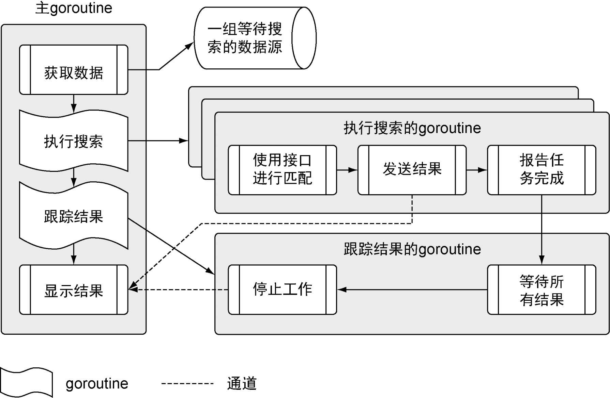

## 主要内容
* **如何写 go 程序**
* **声明变量、函数、方法**
* **同步 goroutine**
* **使用接口通用的代码**
* **处理程序的错误、异常**
  
## 程序架构

`程序代码清单`
`sample`
`- data`
`-- data.json`
`- matchers`
`-- rss.go`
`- search`
`-- default.go`
`-- feed.go`
`-- match.go`
`-- search.go`
`- main.go`

